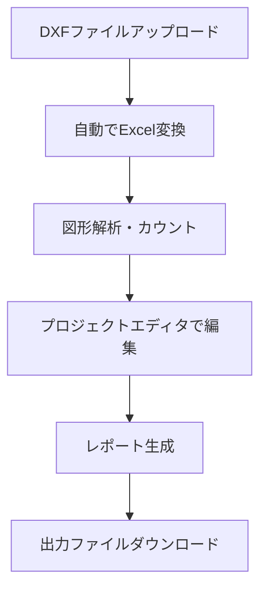

# ユーザーガイド

## 目次
1. [はじめに](#はじめに)
2. [ユーザー登録・ログイン](#ユーザー登録・ログイン)
3. [基本的な使用方法](#基本的な使用方法)
4. [DXF図形解析機能](#dxf図形解析機能)
5. [プロジェクト管理](#プロジェクト管理)
6. [レポート生成](#レポート生成)
7. [よくある質問](#よくある質問)

## はじめに

TrustCAD Analyzerは、交通制御システムの設計・積算業務を効率化するWebアプリケーションです。CAD図面から交通信号機器を自動で検出・カウントし、積算レポートを生成することができます。

## ユーザー登録・ログイン

### 新規ユーザー登録

1. アプリケーション起動後、ブラウザで`http://localhost:5000`にアクセス
2. 「新規登録」ボタンをクリック
3. ユーザー名とパスワードを入力
4. 「登録」ボタンをクリック

### ログイン

1. トップページで「ログイン」をクリック
2. 登録済みのユーザー名とパスワードを入力
3. 「ログイン」ボタンをクリック

## 基本的な使用方法

### プロジェクトの作成

1. ログイン後、メインメニューから「プロジェクト管理」を選択
2. 「新しいプロジェクト」ボタンをクリック
3. プロジェクト名を入力
4. DXFファイルをアップロード
5. 「作成してエディタを開く」をクリック

### ワークフロー概要

## DXF図形解析機能

### 機能の概要

DXF図形解析機能では、アップロードしたCAD図面から以下の機器を自動検出できます：

#### 検出可能な機器一覧

| カテゴリ | 機器名 | コード |
|----------|--------|--------|
| **柱類** | 専用柱 | 01-01 |
|  | 関電柱 | 01-02 |
|  | 照明柱 | 01-04 |
|  | 照明 | 01-05, 01-06 |
| **車両用灯器** | 横型3位式 | 02-01 |
|  | 両面横型3位式 | 02-02 |
|  | 灯箱のみ 横型3位式 | 02-10 |
|  | 縦型3位式 | 02-13 |
|  | 予告灯用 | 02-14 |
|  | 矢印灯器(直進) | 02-18 |
| **歩行者用灯器** | 2位式(抱込型) | 03-01 |
| **設備** | 制御機 | 04-01 |
|  | 付加装置 | 04-02 |
| **感知器** | 感知器アーム | 05-02 |
| **形態** | ハンドホール | 06-01 |

### 図形解析の使用方法

1. メインメニューから「DXF図形カウンター」を選択
2. 解析対象のプロジェクトを選択（既存プロジェクト）、または新しいDXFファイルをアップロード
3. 検出したい機器タイプを選択：
   - **専用機器**: 上記リストの特定機器を検出
   - **車両用信号機**: 車両用灯器全般を検出
   - **歩行者用信号機**: 歩行者用灯器全般を検出
4. 「検索実行」ボタンをクリック
5. 検出結果を確認し、プロジェクトに追加

### 検索パラメータの調整

高度な検索を行う場合は、以下のパラメータを調整できます：

- **検索半径**: 図形の検出範囲
- **許容誤差**: 図形認識の精度調整
- **色フィルター**: 特定の色の図形のみを対象とする

## プロジェクト管理

### プロジェクトエディタの機能

プロジェクトエディタでは以下の操作が可能です：

#### 基本情報の編集
- **工事場所**: プロジェクトの工事場所を設定
- **合計金額**: 積算の合計金額を入力
- **ページ番号**: レポートのページ番号を設定

#### 項目の編集
- **品名**: 検出された機器の名称
- **品質**: 機器の品質・仕様
- **数量**: 検出された数量（手動調整可能）
- **単位**: 数量の単位（式、台、箇所など）
- **色**: DXFファイル内での表示色

#### 項目の操作
- **追加**: 新しい項目を手動で追加
- **削除**: 不要な項目を削除
- **並び替え**: 項目の順序を変更
- **小計挿入**: 項目グループの小計行を追加

### プロジェクトの管理操作

#### プロジェクト一覧での操作
- **開く**: プロジェクトエディタで編集
- **削除**: プロジェクトとファイルを完全削除
- **複製**: プロジェクトのコピーを作成

## レポート生成

### 出力形式の種類

#### 1. 印刷用レポート
- ブラウザで表示・印刷用のHTML形式
- 工事積算書の標準フォーマット
- プロジェクト情報と項目一覧を含む

#### 2. 色変更Excel
- 検出された図形の色情報を変更したExcelファイル
- DXFデータの各図形要素をシート別に整理
- 色による図形の分類・管理が可能

#### 3. DXF再変換
- 編集内容を反映した新しいDXFファイル
- CADソフトウェアで直接開ける
- 色分けされた図形データを含む

### レポートの生成手順

1. プロジェクトエディタで「生成・出力」セクションを確認
2. 目的に応じてボタンを選択：
   - **印刷用レポート**: 新しいタブで表示
   - **色変更Excel**: ファイルダウンロード
   - **DXF再変換**: ファイルダウンロード
3. ダウンロードされたファイルを確認・保存

## よくある質問

### Q1: DXFファイルがアップロードできません

**A**: 以下を確認してください：
- ファイル形式が`.dxf`であること
- ファイルサイズが10MB未満であること
- DXFバージョンがR2010以降であること

### Q2: 機器が正しく検出されません

**A**: 図面の描画方法により検出精度が変わります：
- 標準的な図形要素（線、円、円弧）で描画されていること
- 図形が適切な縮尺で描画されていること
- 重複する図形要素がないこと

### Q3: 検出数量を手動で修正したい

**A**: プロジェクトエディタで直接編集可能です：
1. 該当項目の「数量」欄をクリック
2. 正しい数量を入力
3. 「更新」ボタンをクリック

### Q4: 複数のプロジェクトを同時に作業できますか？

**A**: はい、可能です。ただし：
- 各プロジェクトは独立して管理されます
- メモリ使用量を考慮し、大きなファイルを扱う場合は注意してください

### Q5: データのバックアップ方法は？

**A**: 以下の方法があります：
- **Excelファイル**: 各プロジェクトから「色変更Excel」をダウンロード
- **データベース**: `app_final.db`ファイルをコピー
- **アップロードファイル**: `uploads/`フォルダをバックアップ

### Q6: 検出できない機器がある場合は？

**A**: 以下の方法で対応してください：
1. プロジェクトエディタで手動項目を追加
2. 検索パラメータを調整して再検索
3. 図面の描画方法を標準化

### Q7: システムが重い・遅い場合は？

**A**: パフォーマンス改善方法：
- 使用していないプロジェクトを削除
- DXFファイルのサイズを最小化
- ブラウザのキャッシュをクリア
- システムの再起動

---

その他ご不明な点がありましたら、GitHub Issuesでお気軽にお問い合わせください。